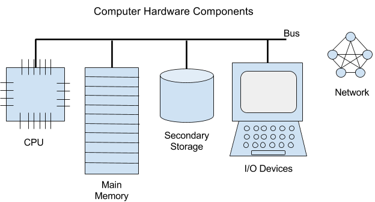

# INTRO TO PROGRAMMING

## COMPUTER SCIENCE
A complex definition: **Computer Science** is the study of information technology, processes, and their interactions with the world.

A simple definition: Computer **Science** is the study of using computers to solve problems.

## COMPUTER BASICS
A **computer** is a machine that performs computations based on instructions.

A **computer** is made up of two components:

*hardware*

*software*

**Hardware** consists of the physical components of your computer. If you can kick it, punch it, or pick it up to throw it, it’s hardware.

**Software**, on the other hand, is not a physical component. Software consists of a set of instructions for the hardware. These instructions are typically saved in files on your computer. The instructions aren’t in English or any other spoken language; they are in a special type of language, called a *programming language*.

To sum it up, **hardware** is anything you can physically touch. **Software** provides the instructions that tell the hardware what to do.

A **program** is a synonym for a piece of software, or an application. In essence, it’s a file saved on your computer, written in a programming language, that contains instructions to tell the computer what to do when the program is launched.

**Code** is a synonym for the “instructions” within a file. It’s also synonymous with software. “Code” is just a bunch of words and punctuation symbols within a computer program, written in a programming language.

## COMPUTER HARDWARE
To learn programming, you must first learn the basics of **computer hardware**.

The different components of computer hardware each serve various purposes.

There are 6 main components that make up a computer’s **hardware**:

1. The *Central Processing Unit* (*CPU*)
2. *Main Memory*
3. *Secondary Storage*
4. *Input/Output Devices* (*I/O Devices*)
5. *Network*
6. *Bus*

The **CPU** is often called the “brain” of the computer. It is responsible for executing instructions, such as the code in a program.

The **Main Memory**, also referred to as “**Random Access Memory”** (**RAM**), is used to store: 1) the code from your programs and 2) the data that the code operates on while the program is actively running. When you open an application such as Microsoft Word on your computer, the code to run Microsoft Word gets loaded into **main memory**.

**Secondary Storage** stores your programs and data when they are not actively being used.

**I/O Devices** allow people to interact with the computer. I/O Devices allow people to input data into the computer (keyboard, mouse, microphone) or output data to the user (monitor, printer, speakers).

The **Bus** is a group of wires that connect the different hardware components. These wires allow data to be passed between the different hardware components. For instance, when you run a program on your computer, the bus sends the data (including the actual code of the program) stored in Secondary Storage to the Main Memory.

A **Network** allows your computer to connect to other computers around the world. Networks allow you to send and receive data from other computers, such as an email to or from a friend.

## PROGRAMMING TERMINOLOGY — SYNONYMS
In general terms, you can think of each of the following three groupings of words as synonyms. While each can denote something that varies slightly, for your introductory understanding, you can think of the following as being equivalent:

1. “code” = “computer instructions” = “software” = “program” = “app” = “application”
1. “coding” = “programming” = “software development” = “software engineering”
1. “programmer” = “coder” = “software developer” = “web developer” = “software engineer”

## MACHINE LANGUAGE VS. PROGRAMMING LANGUAGE
Computers and humans represent and understand information in *different formats*.

Anytime you save **data** (such as a Word document) to you computer, the computer stores all the characters you type in a special format, called **binary**, also known as **machine language**.

**Binary** is a language made up of combinations of 0s and 1s. Each character on your keyboard has a unique binary representation that distinguishes the character from the rest.

A *character* can be a letter, numerical digit, punctuation sign, symbol, space, next line return, tab, etc. Each character has a unique numerical code that distinguishes it from others. You can find out the numerical code (ASCII code) for each character by looking it up in an [ASCII table](https://www.cs.cmu.edu/~pattis/15-1XX/common/handouts/ascii.html).

Notice that the character ‘A’ is separately distinguished from ‘a’.

‘A’ has the numerical code: 65

‘a’ has the numerical code: 97

This means, anytime the character ‘a’ appears in your document, your computer saves the data for it in the binary equivalent to the value 97.

Note that 97 is a human-readable format, which is called “*Decimal*” format. “Decimal” is the name of the format for numerical values represented in base-10, meaning that the digits 0–9 are used to form the values.

“Binary” format implies that the numerical values are represented in base-2, meaning that the digits 0 and 1 are used to form the values. That may sound pretty abstract, but you can surprisingly convert a decimal number to binary (and binary to decimal) using mathematical formulas. There’s no need to do this — this is just for your information. If you actually wanted to get the binary representation of a decimal number, you can use a [calculator](https://codebeautify.org/decimal-binary-converter).

When you save your Word document and close your Word application, your computer actually saves your document in 0s and 1s. People designed computers to be efficiently used by humans. Since binary language isn’t an efficient means of communication for humans, it would not make sense for humans to see their Word documents in binary format. For that reason, when you later reopen your document, it will be translated from binary format and back into English (or whichever language you used).

**Binary** (“**machine language**”) is referred to as a “**low-level language**.” It’s considered to be “low-level” because it is a language that machines understand.

Programmers type their programs in a **programming language**.

A **programming language** is referred to as a “**high-level language**” since it is a language that humans can read and understand.

Just like English, a programming language also has its own set of rules, or **syntax**. It also contains a set of defined words called **keywords** (or “reserved words”) that have a specific meaning when used in a program.

## PROGRAMMING PARADIGMS
Just as there are many different spoken languages that humans communicate in, there are also many different programming languages programmers use to create programs.

A programmer who knows several different programming languages will select the most appropriate programming language to use in each particular circumstance. For instance, there are programming languages that are more suitable for *web development* (making websites) and there are others that are more suitable for *mobile development* (making smartphone apps).

In addition to specifics such as the type of development, at a more granular level, programming languages are classified into different **programming paradigms**.

Here’s a simple definition for the word “paradigm.”

A **paradigm** is a way of thinking or a way of doing something. A paradigm is a mindset.

A **programming paradigm** is a way of classifying a programming language based on the style or methodology of programming.

Here are a few common types of **programming paradigms**:

- The **functional** programming paradigm
- The **procedural** programming paradigm
- The **imperative** programming paradigm
- The **object-oriented** programming paradigm

As an example, *Java* and *C* are examples of *programming languages*. The *Java programming language* is an example of an **object-oriented** programming language. The *C programming language* is an example of a **procedural** programming language.

For now, you don’t need to know what it means for a programming language to be classified as **object-oriented** or **procedural**. However, it just helps to understand that there are different classifications for the various programming languages.

## WRITING AND SAVING YOUR CODE
The first step in the software process involves **programming**, which simply means to write **code**. A programmer writes code to create a **program**. A **program** is simply an **application** that does something, or achieves some goal, when the user of the application launches it. As the programmer, your goal is determine what you want your code to do, and to write the code.

When you want to write an essay, you use a computer application such as Word or any text editor. You simply open the text editor application, create a file, type in some text, and save your document in the desired file format, such as .docx or .pdf.

The process of writing code is similar.

You can write your code using a text editor or an **Integrated Development Environment** (**IDE**). An **IDE** is a computer application that contains all the tools you need to program, such as a text editor, a *compiler*, a *runtime environment*, and a *debugger*.

A **debugger** is a tool that programmers use to find mistakes in their code, called **bugs**. For instance, A bug may either prevent a program from *compiling*, prevent a program *executing* (running), or may cause a program to produce incorrect values. Learning how to debug a program is a skill that you will develop over the course of your professional life.

After you create your program, you must save your code within a **file**, called a *source file*. 

A **source file** is simply a file that contains **source code**, which is your program’s code. Saving your code within a source file requires naming the file with a *root name* and an *extension*. The **root name** is the unique name you choose to give your file, which is comprised of the characters appearing to the left of the *dot* (**.**) of your file name, and the **extension** is what appears to the right of the dot. You give the source file the extension expected according to the programming language of your source code. For instance, the extension **.java** is used for source files written in Java, whereas the extension **.c** is used for source files written in C.

## COMPILING AND RUNNING YOUR CODE
Suppose you have written a program in the C programming language and saved your program as myprogram.c. Next, you will want to *run* your code to see if your program does what you had intended it to do.

Before you can run (“*execute*”) your code, your source file needs to be translated from C (the higher-level language) to a binary (the lower-level language) *executable file*. An **executable file** (or, “**executable**”) is a file that contains the binary translation of your code and, when launched, it will **run**(“**execute**”) your program. This translation process is called *Compilation*.

**Compiling** is the process of translating source code within a source file from higher-level language into lower-level language, and then creating and saving that translated code in an executable file.

A **compiler** is a computer program used for compiling your code. It is a common tool included in an IDE. When using an IDE, the IDE may handle running the compiler program for you when you run your code. When you are not using an IDE, you will need to launch the compiler and specify the source file you would like it to compile for you.

If your program contains no bugs within the code, it will produce the executable, and the compilation process successfully completes. However, if your program contains one or more bugs, it may cause an error, preventing the compiler from producing the executable. If the compiler produces an error, you will need to go back through your code to debug it and correct the mistake(s).

Once you have successfully compiled your program, you can run (“launch” or “execute”) the executable, and your computer will execute the instructions of your program.