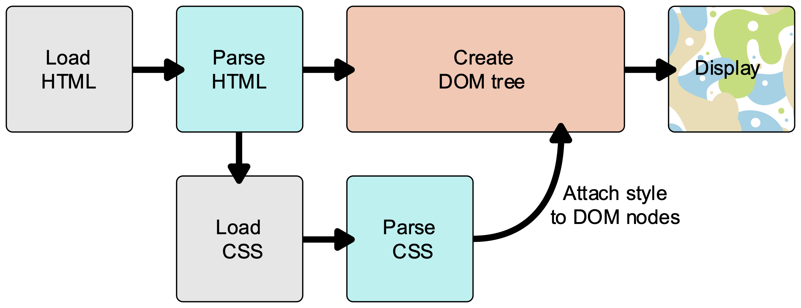
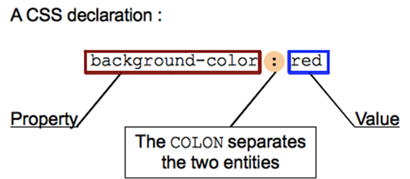
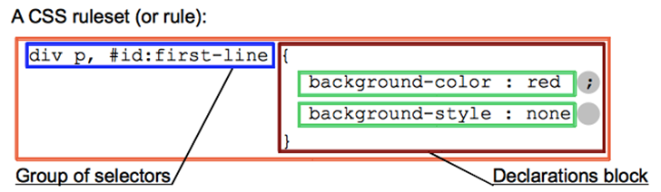
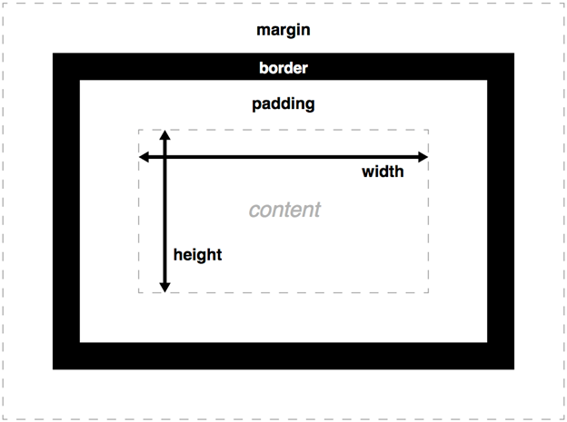

# CSS

Interactive tutorial available at [CodeAcademy](https://www.codecademy.com/courses/learn-css/lessons/learn-css-setup-and-syntax/exercises/intro-to-css)

## WHAT IS CSS
As we have mentioned before, CSS is a language for specifying how documents are presented to users — how they are styled, laid out, etc. Web browsers apply CSS rules to a document to affect how they are displayed.

The above descriptions may or may not have made sense, so let's make sure things are clear by presenting a quick example. First of all, let's take a simple HTML document, containing an [`<h1>`](https://developer.mozilla.org/en-US/docs/Web/HTML/Element/h1) and a [`<p>`](https://developer.mozilla.org/en-US/docs/Web/HTML/Element/p).
> Note: Notice that a stylesheet is applied to the HTML using an [`<link>`](https://developer.mozilla.org/en-US/docs/Web/HTML/Element/link) element

   ```bash
   <!DOCTYPE html>
   <html>
   <head>
      <meta charset="utf-8">
      <title>My CSS experiment</title>
      <style >
         h1 {
            color: blue;
            background-color: yellow;
            border: 1px solid black;
            }

         p {
            color: red;
            }
      </style>
   </head>
   <body>
      <h1>Hello World!</h1>
      <p>This is my first CSS example</p>
   </body>
   </html>
   ```

The first rule starts with an h1 selector, which means that it will apply its property values to the [`<h1>`](https://developer.mozilla.org/en-US/docs/Web/HTML/Element/h1) element. It contains three properties and their values (each property/value pair is called a **declaration**):

- The first one sets the text color to blue.
- The second sets the background color to yellow.
- The third one puts a border around the header that is 1 pixel wide, solid (not dotted, or dashed, etc.), and colored black.

The second rule starts with a `p` selector, which means that it will apply its property values to the [`<p>`](https://developer.mozilla.org/en-US/docs/Web/HTML/Element/p) element. It contains one declaration, which sets the text color to red.

## HOW DOES CSS ACTUALLY WORK?
When a browser displays a document, it must combine the document's content with its style information. It processes the document in two stages:

1. The browser converts [HTML](https://developer.mozilla.org/en-US/docs/Glossary/HTML) is a descriptive language that specifies webpage structure.") and [CSS](https://developer.mozilla.org/en-US/docs/Glossary/CSS) into the [DOM](https://developer.mozilla.org/en-US/docs/Glossary/DOM) (*Document Object Model*). The DOM represents the document in the computer's memory. It combines the document's content with its style.
2. The browser displays the contents of the DOM.

A DOM has a tree-like structure. Each element, attribute and piece of text in the markup language becomes a [DOM node](https://developer.mozilla.org/en-US/docs/Glossary/Node/DOM) in the tree structure. The nodes are defined by their relationship to other DOM nodes. Some elements are parents of child nodes, and child nodes have siblings.

Understanding the DOM helps you design, debug and maintain your CSS because the DOM is where your CSS and the document's content meet up.



## HOW TO APPLY YOUR CSS TO YOU HTML
There are three different ways to apply CSS to an HTML document that you'll commonly come across, some more useful than others. Here we'll briefly review each one.

1. External Stylesheet
   ```bash
   <link rel="stylesheet" href="style.css">
   ```
2. Internal Stylesheet
   ```bash
   <style></style>
   ```
3. Inline Styles
   ```bash
   <p style=”color: blue”></p>
   ```

## CSS SYNTAX
At its most basic level, CSS consists of two building blocks:

- **Properties**: Human-readable identifiers that indicate which stylistic features (e.g. font, width, background color) you want to change.
- **Values**: Each specified property is given a value, which indicates how you want to change those stylistic features (e.g. what you want to change the font, width or background color to.)

A property paired with a value is called a [CSS declaration](https://developer.mozilla.org/en-US/docs/Learn/CSS/Introduction_to_CSS/Syntax#CSS_declarations). CSS declarations are put within *CSS Declaration Blocks*. And finally, CSS declaration blocks are paired with *selectors* to produce *CSS Rulesets* (or *CSS Rules*).
   ```bash
   h1 {
   colour: blue;
   background-color: yellow;
   border: 1px solid black;
   }

   p {
   color: red;
   }

   p, li {
   text-decoration: underline;
   }
   ```
## CSS DECLARATIONS
Setting CSS properties to specific values is the core function of the CSS language. The CSS engine calculates which declarations apply to every single element of a page in order to appropriately lay it out and style it. The property and value in each pair is separated by a colon `:`.



There are more than [300 different properties](https://developer.mozilla.org/en-US/docs/Web/CSS/Reference) in CSS and nearly an infinite number of different values. Not all pairs of properties and [values](https://developer.mozilla.org/en-US/docs/Web/CSS/CSS_Values_and_Units) are allowed; each property has a specific list of valid values defined for it.

Declarations are grouped in **blocks**, with each set of declarations being wrapped by an opening curly brace, (`{`) and a closing one (`}`).

Each declaration contained inside a **declaration block** has to be separated by a semi-colon (`;`), otherwise the code won't work (or will at least give unexpected results.) 

We are missing one part of the puzzle — we need to discuss how to tell our declaration blocks which elements they should be applied to. This is done by prefixing each declaration block with a **selector** — a pattern that matches some elements on the page. The associated declarations will be applied to those elements only. The selector plus the declaration block is called a **ruleset**, or often simply just a **rule**.



Selectors can get very complicated — you can make a rule match multiple elements by including multiple selectors separated by commas (a group,) and selectors can be chained together
> Example: *I want to select any element with a class of "blah", but only if it is inside an <article> element, and only while it is being hovered by the mouse pointer*. 

Don't worry — things will become clearer as you become more experienced with CSS, and we'll explain selectors in great detail in the next article, [Selectors](https://developer.mozilla.org/en-US/docs/Learn/CSS/Introduction_to_CSS/Selectors).

An element may be matched by several selectors, therefore several rules may set a given property multiple times. CSS defines which one has precedence over the others and must be applied: this is called the **cascade algorithm**, and you'll learn more about how it works in [Cascade and inheritance](https://developer.mozilla.org/en-US/docs/Learn/CSS/Introduction_to_CSS/Cascade_and_inheritance).

### ELEMENT SELECTORS
This selector is just a case-insensitive match between the selector name and a given HTML element name. This is the simplest way to target all elements of a given type.
   ```bash
   p {
   color: red;
   }
   ```
   ```bash
   <p>I prefer BLACK!</p>
   ```

### CLASS SELECTORS
The class selector consists of a dot (`.`), followed by a class name. A class name is any value, without spaces, placed within an HTML [class](https://developer.mozilla.org/en-US/docs/Web/HTML/Global_attributes#attr-class) attribute. It is up to you to choose a name for the class. It is also noteworthy that multiple elements in a document can have the same class value, and a single element can have multiple class names separated by white space. Here's a quick example:

Here is some HTML:

   ```bash
   <ul>
   <li class="first done">Create an HTML document</li>
   <li class="second done">Create a CSS style sheet</li>
   <li class="third">Link them all together</li>
   </ul>
   ```

A simple style sheet that styles two of these classes:
   ```bash
   /* The element with the class "first" is bolded */
   .first {
   font-weight: bold;
   }
   /* All the elements with the class "done" are strikethrough */
   .done {
   text-decoration: line-through;
   }
   ```

### ID SELECTORS
The ID selector consists of a hash/pound symbol (#), followed by the ID name of a given element. Any element can have a unique ID name set with the [id](https://developer.mozilla.org/en-US/docs/Web/HTML/Global_attributes#attr-id) attribute. It is up to you to choose an ID name. It's the most efficient way to select a single element.

Let's look at a quick example — here is some HTML:
   ```bash
   <p id="polite"> — "Good morning."</p>
   <p id="rude"> — "Go away!"</p>
   ```

A simple style sheet:
   ```bash
   #polite {
   font-family: cursive;
   }

   #rude {
   font-family: monospace;
   text-transform: uppercase;
   }
   ```

## THE BOX MODEL
The CSS box model is the foundation of layout on the Web — each element is represented as a rectangular box, with the box's content, padding, border, and margin built up around one another like the layers of an onion. As a browser renders a web page layout, it works out what styles are applied to the content of each box, how big the surrounding onion layers are, and where the boxes sit in relation to one another. Before understanding how to create CSS layouts, you need to understand the box model.

### BOX PROPERTIES
Every element within a document is structured as a rectangular box inside the document layout, the size and "onion layers" of which can be tweaked using some specific CSS properties. The relevant properties are as follows:



### WIDTH AND HEIGHT
The [width](https://developer.mozilla.org/en-US/docs/Web/CSS/width) and [height](https://developer.mozilla.org/en-US/docs/Web/CSS/height) properties set the width and height of the **content box**, which is the area in which the content of the box is displayed — this content includes both text content set inside the box, and other boxes representing nested child elements.

> Note: Other properties exist that allow more subtle ways of handling content box size — setting size constraints rather than an absolute size. This can be done with the properties [min-width](https://developer.mozilla.org/en-US/docs/Web/CSS/min-width), [max-width](https://developer.mozilla.org/en-US/docs/Web/CSS/max-width), [min-height](https://developer.mozilla.org/en-US/docs/Web/CSS/min-height), and [max-height](https://developer.mozilla.org/en-US/docs/Web/CSS/max-height).

### PADDING
**Padding** refers to the *inner* margin of a CSS box — between the outer edge of the content box and the inner edge of the border. The size of this layer can be set on all four sides at once with the [padding](https://developer.mozilla.org/en-US/docs/Web/CSS/padding) shorthand property, or one side at a time with the [padding-top](https://developer.mozilla.org/en-US/docs/Web/CSS/padding-top), [padding-right](https://developer.mozilla.org/en-US/docs/Web/CSS/padding-right), [padding-bottom](https://developer.mozilla.org/en-US/docs/Web/CSS/padding-bottom) and [padding-left](https://developer.mozilla.org/en-US/docs/Web/CSS/padding-left) properties.

### BORDER
The **border** of a CSS box sits between the outer edge of the padding and the inner edge of the margin. By default the border has a size of 0 — making it invisible — but you can set the thickness, style and color of the border to make it appear. The [border](https://developer.mozilla.org/en-US/docs/Web/CSS/border) shorthand property allows you to set all of these on all four sides at once, for example border: 1px solid black. This can be broken down into numerous different longhand properties for more specific styling needs:

- [border-top](https://developer.mozilla.org/en-US/docs/Web/CSS/border-top), [border-right](https://developer.mozilla.org/en-US/docs/Web/CSS/border-right), [border-bottom](https://developer.mozilla.org/en-US/docs/Web/CSS/border-bottom), [border-left](https://developer.mozilla.org/en-US/docs/Web/CSS/border-left): Set the thickness, style and color of one side of the border.
- [border-width](https://developer.mozilla.org/en-US/docs/Web/CSS/border-width), [border-style](https://developer.mozilla.org/en-US/docs/Web/CSS/border-style), [border-color](https://developer.mozilla.org/en-US/docs/Web/CSS/border-color): Set only the thickness, style, or color individually, but for all four sides of the border.
- You can also set one of the three properties of a single side of the border individually, using [border-top-width](https://developer.mozilla.org/en-US/docs/Web/CSS/border-top-width), [border-top-style](https://developer.mozilla.org/en-US/docs/Web/CSS/border-top-style), [border-top-color](https://developer.mozilla.org/en-US/docs/Web/CSS/border-top-color), etc. 

### MARGIN
The margin surrounds a CSS box, and pushes up against other CSS boxes in the layout. It behaves rather like padding; the shorthand property is [margin](https://developer.mozilla.org/en-US/docs/Web/CSS/margin) and the individual properties are [margin-top](https://developer.mozilla.org/en-US/docs/Web/CSS/margin-top), [margin-right](https://developer.mozilla.org/en-US/docs/Web/CSS/margin-right), [margin-bottom](https://developer.mozilla.org/en-US/docs/Web/CSS/margin-bottom), and [margin-left](https://developer.mozilla.org/en-US/docs/Web/CSS/margin-left).