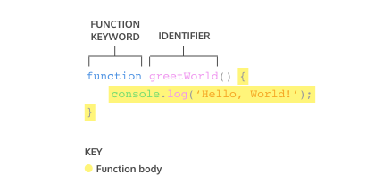
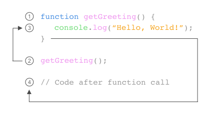
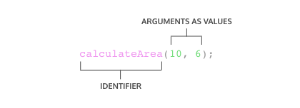
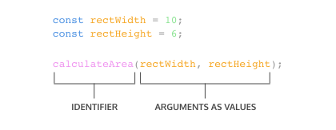
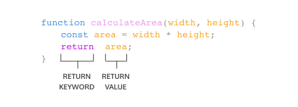
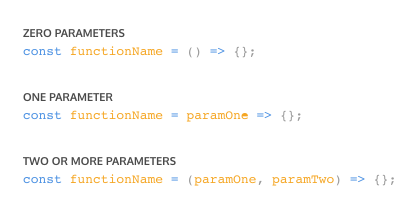
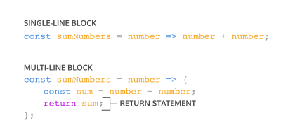
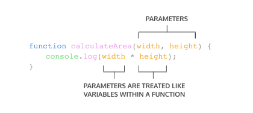
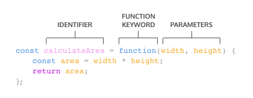
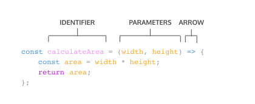

# FUNCTIONS

Interactive tutorial available at [CodeAcademy](https://www.codecademy.com/courses/introduction-to-javascript/lessons/functions/exercises/intro-to-functions)

## WHAT ARE FUNCTIONS?
When first learning how to calculate the area of a rectangle, there’s a sequence of steps to calculate the correct answer:

1. Measure the width of the rectangle.
2. Measure the height of the rectangle.
3. Multiply the width and height of the rectangle.

With practice, you can calculate the area of the rectangle without being instructed with these three steps every time.

We can calculate the area of one rectangle with the following code:
   ```js
   const width = 10;

   const height = 6;

   const area =  width \* height;

   console.log(area); // Output: 60
   ```

Imagine being asked to calculate the area of three different rectangles:
   ```js
   // Area of the first rectangle

   const width1 = 10;

   const height1 = 6;

   const area1 =  width1 \* height1;

   // Area of the second rectangle

   const width2 = 4;

   const height2 = 9;

   const area2 =  width2 \* height2;

   // Area of the third rectangle

   const width3 = 10;

   const height3 = 10;

   const area3 =  width3 \* height3;
   ```

In programming, we often use code to perform a specific task multiple times. Instead of rewriting the same code, we can group a block of code together and associate it with one task, then we can reuse that block of code whenever we need to perform the task again. We achieve this by creating a *function*. A function is a reusable block of code that groups together a sequence of statements to perform a specific task.

In this lesson, you will learn how to create and use functions, and how they can be used to create clearer and more concise code.

## FUNCTION DECLARATIONS
In JavaScript, there are many ways to create a function. One way to create a function is by using a *function declaration*. Just like how a variable declaration binds a value to a variable name, a function declaration binds a function to a name, or an *identifier*. Take a look at the anatomy of a function declaration below:



A function declaration consists of:

- The `function` keyword.
- The name of the function, or its identifier, followed by parentheses.
- A function body, or the block of statements required to perform a specific task, enclosed in the function’s curly brackets, `{ }`.

A function declaration is a function that is bound to an identifier, or name. In the next exercise we’ll go over how to run the code inside the function body.

We should also be aware of the *hoisting* feature in JavaScript which allows access to function declarations before they’re defined.

Take a look at example of hoisting:
   ```js
   console.log(greetWorld()); // Output: Hello, World!

   function greetWorld() {
   console.log('Hello, World!');
   }
   ```

Notice how hoisting allowed `greetWorld()` to be called before the `greetWorld()` function was defined! Since hoisting isn’t considered good practice, we simply want you to be aware of this feature.

If you want to read more about hoisting, check out [MDN documentation on hoisting](https://developer.mozilla.org/en-US/docs/Glossary/Hoisting).

### INSTRUCTIONS
1. Let’s create a function that prints a reminder to the console. Using a function declaration, create a function called `getReminder()`.
2. In the function body of `getReminder()`, log the following reminder to the console: `'Water the plants.'`
3. Let’s create another function that prints a useful Spanish travel phrase to the console.

   Using a function declaration, create a function called `greetInSpanish()`.
4. Add code to the function body of `greetInSpanish()`:

   In the function body `console.log()` the following Spanish phrase to the console: `'Buenas Tardes.'`

## CALLING A FUNCTION
As we saw in previous exercises, a function declaration binds a function to an identifier.

However, a function declaration does not ask the code inside the function body to run, it just declares the existence of the function. The code inside a function body runs, or *executes*, only when the function is *called*. To call a function in your code, you type the function name followed by parentheses.


This function *call* executes the function body, or all of the statements between the curly braces in the function declaration.



We can call the same function as many times as needed.

Let’s practice calling functions in our code.

### INSTRUCTIONS
1. Imagine that you manage an online store. When a customer places an order, you send them a thank you note. Let’s create a function to complete this task:
   - Define a function called `sayThanks()` as a function declaration.
   - In the function body of `sayThanks()`, add code such that the function writes the following thank you message to the console when called: `'Thank you for your purchase! We appreciate your business.'`
2. Call `sayThanks()` to view the thank you message in the console.
3. Functions can be called as many times as you need them.

   Imagine that three customers placed an order and you wanted to send each of them a thank you message. Update your code to call `sayThanks()` three times.

## PARAMETERS AND ARGUMENTS
So far, the functions we’ve created execute a task without an input. However, some functions can take inputs and use the inputs to perform a task. When declaring a function, we can specify its PARAMETERS. Parameters allow functions to accept input(s) and perform a task using the input(s). We use parameters as placeholders for information that will be passed to the function when it is called.

Let’s observe how to specify parameters in our function declaration:


In the diagram above, `calculateArea()`, computes the area of a rectangle, based on two inputs, `width` and `height`. The parameters are specified between the parenthesis as `width` and `height`, and inside the function body, they act just like regular variables. `width` and `height` act as placeholders for values that will be multiplied together.

When calling a function that has parameters, we specify the values in the parentheses that follow the function name. The values that are passed to the function when it is called are called ARGUMENTS. Arguments can be passed to the function as values or variables.



In the function call above, the number `10` is passed as the `width` and `6` is passed as `height`. Notice that the order in which arguments are passed and assigned follows the order that the parameters are declared.


The variables `rectWidth` and `rectHeight` are initialized with the values for the height and width of a rectangle before being used in the function call.

By using parameters, `calculateArea()` can be reused to compute the area of any rectangle! Functions are a powerful tool in computer programming so let’s practice creating and calling functions with parameters.

### INSTRUCTIONS
1. The `sayThanks()` function works well, but let’s add the customer’s name in the message.

   Add a parameter called `name` to the function declaration for `sayThanks()`.

1. With `name` as a parameter, it can be used as a variable in the function body of `sayThanks()`.

   Using `name` and string concatenation, change the thank you message into the following:
   ```bash
   'Thank you for your purchase '+ name + '! We appreciate your business.'
   ```

   Copy and paste the above message into your code.

1. A customer named Cole just purchased something from your online store. Call `sayThanks()` and pass `'Cole'` as an argument to send Cole a personalized thank you message.
## DEFAULT PARAMETERS
One of the features added in ES6 is the ability to use *default parameters*. Default parameters allow parameters to have a predetermined value in case there is no argument passed into the function or if the argument is `undefined` when called.

Take a look at the code snippet below that uses a default parameter:
   ```js
   function greeting (name = 'stranger') {
   console.log(`Hello, ${name}!`)
   }

   greeting('Nick') // Output: Hello, Nick!
   greeting() // Output: Hello, stranger!
   ```

- In the example above, we used the = operator to assign the parameter `name` a default value of `'stranger'`. This is useful to have in case we ever want to include a non-personalized default greeting!
- When the code calls `greeting('Nick')` the value of the argument is passed in and, 'Nick', will override the default parameter of `'stranger'` to log `'Hello, Nick!'` to the console.
- When there isn’t an argument passed into `greeting()`, the default value of `'stranger'` is used, and `'Hello, stranger!'` is logged to the console.

By using a default parameter, we account for situations when an argument isn’t passed into a function that is expecting an argument.

Let’s practice creating functions that use default parameters.

### INSTRUCTIONS
1. The function `makeShoppingList()` creates a shopping list based on the items that are passed to the function as arguments.

   Imagine that you always purchase milk, bread, and eggs every time you go shopping for groceries. To make creating a grocery list easier, let’s assign default values to the parameters in `makeShoppingList()`.

   Change the parameters of `makeShoppingList()` into default parameters :

   - Assign ‘milk’ as the default value of `item1`.
   - Assign ‘bread’ as the default value of `item2`.
   - Assign ‘eggs’ as the default value of `item3`.

## RETURN
When a function is called, the computer will run through the function’s code and evaluate the result of calling the function. By default, that resulting value is `undefined`.
   ```js
   function rectangleArea(width, height) {
   let area = width * height 
   }
   console.log(rectangleArea(5, 7)) // Prints undefined
   ```

In the code example, we defined our function to calculate the `area` of a `width` and `height` parameter. Then `rectangleArea()` is invoked with the arguments 5 and 7. But when we went to print the results we got `undefined`. Did we write our function wrong? No! In fact, the function worked fine, and the computer did calculate the area as `35`, but we didn’t capture it. So how can we do that? With the keyword `return`!



To pass back information from the function call, we use a return statement. To create a return statement, we use the return keyword followed by the value that we wish to `return`. Like we saw above, if the value is omitted, `undefined` is returned instead.

When a `return` statement is used in a function body, the execution of the function is stopped and the code that follows it will not be executed. Look at the example below:
   ```js
   function rectangleArea(width, height) {
   if (width < 0 || height < 0) {
      return 'You need positive integers to calculate area!';
   }
   return width * height;
   }
   ```

If an argument for `width` or `height` is less than `0`, then `rectangleArea()` will return `'You need positive integers to calculate area!'`. The second return statement `width * height` will not run.

The `return` keyword is powerful because it allows functions to produce an output. We can then save the output to a variable for later use.

### INSTRUCTIONS
1. Imagine if we needed to order monitors for everyone in an office and this office is conveniently arranged in a grid shape. We could use a function to help us calculate the number of monitors needed!

   Declare a function `monitorCount()` that has two parameters. The first parameter is `rows` and the second parameter is `columns`.

2. Let’s compute the number of monitors by multiplying `rows` and `columns` and then returning the value.

   In the function body of the function you just wrote, use the `return` keyword to return rows `* columns`.
3. Now that the function is defined, we can compute the number of monitors needed. Let’s say that the office has 5 rows and 4 columns.

   Declare a variable named `numOfMonitors` using the `const` keyword and assign `numOfMonitors` the value of invoking `monitorCount()` with the arguments `5` and `4`.

4. To check that the function worked properly, log `numOfMonitors` to the console.

## HELPER FUNCTIONS
We can also use the return value of a function inside another function. These functions being called within another function are often referred to as *helper functions*. Since each function is carrying out a specific task, it makes our code easier to read and debug if necessary.

If we wanted to define a function that converts the temperature from Celsius to Fahrenheit, we could write two functions like:
   ```js
   function multiplyByNineFifths(number) {
   return number * (9/5);
   };

   function getFahrenheit(celsius) {
   return multiplyByNineFifths(celsius) + 32;
   };

   getFahrenheit(15); // Returns 59
   ```

In the example above:

- `getFahrenheit()` is called and `15` is passed as an argument.
- The code block inside of `getFahrenheit()` calls `multiplyByNineFifths()` and passes `15` as an argument.
- `multiplyByNineFifths()` takes the argument of `15` for the `number` parameter.
- The code block inside of `multiplyByNineFifths()` function multiplies `15` by (`9/5`), which evaluates to `27`.
- `27` is returned back to the function call in `getFahrenheit()`.
- `getFahrenheit()` continues to execute. It adds `32` to `27`, which evaluates to `59`.
- Finally, `59` is returned back to the function call `getFahrenheit(15)`.

We can use functions to section off small bits of logic or tasks, then use them when we need to. Writing helper functions can help take large and difficult tasks and break them into smaller and more manageable tasks.

### INSTRUCTIONS
1. In the previous exercise, we created a function to find the number of monitors to order for an office. Now let’s write another function that uses the `monitorCountfunction` to figure out the price.

   Below monitorCount Create a function declaration named `costOfMonitors` that has two parameters, the first parameter is `rows` and the second parameter is `columns`. Leave the function body empty for now.

2. Time to add some code to the function body of `costOfMonitors` to calculate the total cost.

   Add a `return` statement that returns the value of calling `monitorCount(rows, columns)` multiplied by `200`.

3. We should save the cost to a variable.

   Declare a variable named `totalCost` using the `const` keyword. Assign to totalCost the value of calling `costOfMonitors()` with the arguments 5 and 4respectively.

4. To check that the function worked properly, log `totalCost` to the console.

## FUNCTION EXPRESSIONS
Another way to define a function is to use a *function expression*. To define a function inside an expression, we can use the function keyword. In a function expression, the function name is usually omitted. A function with no name is called an *anonymous function*. A function expression is often stored in a variable in order to refer to it.

Consider the following function expression:


To declare a function expression:

- Declare a variable to make the variable’s name be the name, or identifier, of your function. Since the release of ES6, it is common practice to use `const` as the keyword to declare the variable.
- Assign as that variable’s value an anonymous function created by using the `function` keyword followed by a set of parentheses with possible parameters. Then a set of curly braces that contain the function body.

To invoke a function expression, write the name of the variable in which the function is stored followed by parentheses enclosing any arguments being passed into the function.
   ```js
   variableName(argument1, argument2)
   ```

Unlike function declarations, function expressions are not hoisted so they cannot be called before they are defined.

Let’s define a new function using a function expression.

### INSTRUCTIONS
1. Let’s say we have a plant that we need to water once a week on Wednesdays. We could define a function expression to help us check the day of the week and the plant needs to be watered:
   - Create a variable named `plantNeedsWater` using the `const` variable keyword.
   - Assign an anonymous function that takes in a parameter of `day` to plantNeedsWater.
2. Now we need to add some code to the function body of `plantNeedsWater()`:
   - In the function body add an `if` conditional that checks `day === 'Wednesday'`.
   - If the conditional is truthy, inside the `if` code block, use the `return` keyword to return `true`.
3. On days that aren’t `'Wednesday'`, `plantNeedsWater()` should return `false`:
   - Add an `else` statement after the `if` statement.
   - Inside the `else` statement use the `return` keyword to return `false`.
4. Call the `plantNeedsWater()` and pass in `'Tuesday'` as an argument.
5. Let’s check that `plantNeedsWater()` returned the expected value.

Log `plantNeedsWater('Tuesday')` to the console. If it worked correctly, you should see `false` logged to the console.

## ARROW FUNCTIONS
ES6 introduced ARROW FUNCTION SYNTAX, a shorter way to write functions by using the special “fat arrow” `() =>` notation.

Arrow functions remove the need to type out the keyword `function` every time you need to create a function. Instead, you first include the parameters inside the `( )` and then add an arrow `=>` that points to the function body surrounded in `{ }` like this:
   ```js
   const rectangleArea = (width, height) => {
   let area = width * height;
   return area;
   };
   ```

It’s important to be familiar with the multiple ways of writing functions because you will come across each of these when reading other JavaScript code.

### INSTRUCTIONS
1. Change `plantNeedsWater()` to use arrow function syntax.

## CONCISE BODY ARROW FUNCTIONS
JavaScript also provides several ways to refactor arrow function syntax. The most condensed form of the function is known as *concise body*. We’ll explore a few of these techniques below:

1. Functions that take only a single parameter do not need that parameter to be enclosed in parentheses. However, if a function takes zero or multiple parameters, parentheses are required. 
   
   
2. A function body composed of a single-line block does not need curly braces. Without the curly braces, whatever that line evaluates will be automatically returned. The contents of the block should immediately follow the arrow `=>` and the `return` keyword can be removed. This is referred to as *implicit return*.
   
   

So if we have a function:
   ```js
   const squareNum = (num) => {
   return num * num;
   };
   ```

We can refactor the function to:
   ```js
   const squareNum = num => num * num;
   ```

Notice the following changes:

- The parentheses around `num` have been removed, since it has a single parameter.
- The curly braces `{ }` have been removed since the function consists of a single-line block.
- The `return` keyword has been removed since the function consists of a single-line block.

### INSTRUCTIONS
1. Let’s refactor `plantNeedsWater()` to be a concise body. Notice that we’ve already converted the `if`/`else` statement to a ternary operator to make the code fit on one line.

## REVIEW FUNCTIONS
Give yourself a pat on the back, you just navigated through functions!

In this lesson, we covered some important concepts about functions:

- A function is a reusable block of code that groups together a sequence of statements to perform a specific task.
- A function declaration:

  
- A parameter is a named variable inside a function’s block which will be assigned the value of the argument passed in when the function is invoked:

  
- To *call* a function in your code:

  
- ES6 introduces new ways of handling arbitrary parameters through *default parameters* which allow us to assign a default value to a parameter in case no argument is passed into the function.
- To return a value from a function, we use a *return statement*.
- To define a function using *function expressions*:

  
- To define a function using *arrow function notation*:

  
- Function definition can be made concise using concise arrow notation:

  

It’s good to be aware of the differences between function expressions, arrow functions, and function declarations. As you program more in JavaScript, you’ll see a wide variety of how these function types are used.
