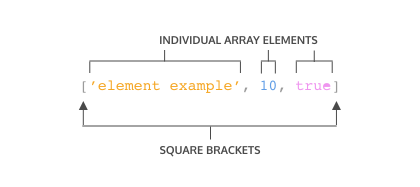
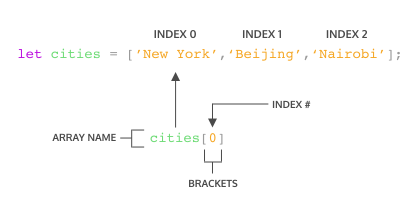

# ARRAYS

Interactive tutorial available at [CodeAcademy](https://www.codecademy.com/courses/introduction-to-javascript/lessons/arrays/exercises/arrays)

## ARRAYS
Organizing and storing data is a foundational concept of programming.

One way we organize data in real life is by making lists. Let’s make one here:
```bash
New Years Resolutions:
1. Keep a journal 
2. Take a falconry class
3. Learn to juggle
```
Let’s now write this list in JavaScript, as an *array*:
```js
let newYearsResolutions = ['Keep a journal', 'Take a falconry class', 'Learn to juggle'];
```

Arrays are JavaScript’s way of making lists. Arrays can store any data types (including strings, numbers, and booleans). Like lists, arrays are ordered, meaning each item has a numbered position.

Here’s an array of the concepts we’ll cover:
```js
let concepts = ['creating arrays', 'array structures', 'array manipulation']
```

By the end of this lesson you’ll have another tool under your belt that helps you manage chunks of data!

### INSTRUCTIONS
1. Run the code to see what is logged to the console.

## CREATE AN ARRAY
One way we can create an array is to use an *array literal*. An array literal creates an array by wrapping items in square brackets `[]`. Remember from the previous exercise, arrays can store any data type — we can have an array that holds all the same data types or an array that holds different data types.



Let’s take a closer look at the syntax in the array example:

- The array is represented by the square brackets [] and the content inside.
- Each content item inside an array is called an *element*.
- There are three different elements inside the array.
- Each element inside the array is a different data type.

We can also save an array to a variable. You may have noticed we did this in the previous exercise:
```js
let newYearsResolutions = ['Keep a journal', 'Take a falconry class', 'Learn to juggle'];
```

Let’s practice by making an array of our own.

### INSTRUCTIONS
1. Declare a variable using `const` named `hobbies` and set it equal to an array with three strings inside of it.

## ACCESSING ELEMENTS
Each element in an array has a numbered position known as its *index*. We can access individual items using their index, which is similar to referencing an item in a list based on the item’s position.

Arrays in JavaScript are *zero-indexed*, meaning the positions start counting from `0` rather than `1`. Therefore, the first item in an array will be at position `0`. Let’s see how we could access an element in an array:



In the code snippet above:

- `cities` is an array that has three elements.
- We’re using bracket notation, `[]` with the index after the name of the array to access the element.
- `cities[0]` will access the element at index 0 in the array `cities`. You can think of `cities[0]` as accessing the space in memory that holds the string `'New York'`.

You can also access individual characters in a string using bracket notation and the index. For instance, you can write:
```js
const hello = 'Hello World';
console.log(hello[6]);
// Output: W
```

The console will display W since it is the character that is at index 6.

### INSTRUCTIONS
1. Individual elements in arrays can also be stored to variables.

    Create a variable named `listItem` and set it equal to the first item in the `famousSayings` array using square bracket notation (`[]`).

    Then use `console.log()` to print the `listItem` variable to the console.

2. Now, `console.log()` the third element in the `famousSayings` array using bracket notation to access the element.

    Do not save the element to a new variable before you log it.

3. Awesome, you can access each element in an array using the index. But what happens if you try to access an index that is beyond the last element?

    Try to log the item at index `[3]` of `famousSayings` to the console. What is logged to the console?

## UPDATE ELEMENTS
In the previous exercise, you learned how to access elements inside an array or a string by using an index. Once you have access to an element in an array, you can update its value.
```js
let seasons = ['Winter', 'Spring', 'Summer', 'Fall'];

seasons[3] = 'Autumn';
console.log(seasons); 
//Output: ['Winter', 'Spring', 'Summer', 'Autumn']
```

In the example above, the `seasons` array contained the names of the four seasons.

However, we decided that we preferred to say 'Autumn'instead of 'Fall'.

The line, `seasons[3] = 'Autumn';` tells our program to change the item at index 3 of the `seasons` array to be `'Autumn'` instead of what is already there.

### INSTRUCTIONS
1. Change the second element of the array `groceryList` to `'avocados'`.

## ARRAYS WITH LET AND CONST
You may recall that you can declare variables with both the `let` and `const` keywords. Variables declared with `let` can be reassigned.

Variables declared with the `const` keyword cannot be reassigned. However, elements in an array declared with `const` remain mutable. Meaning that we can change the contents of a `const` array, but cannot reassign a new array or a different value.

The instructions below will illustrate this concept more clearly. Pay close attention to the similarities and differences between the `condiments` array and the `utensils` array as you complete the steps.

### INSTRUCTIONS
1. Below the two existing arrays, re-assign the element in index `0` of `condiments` to `'Mayo'`.

    Log the updated array, `condiments`, to the console.

2. Below your code from Step 1, reassign `condiments` to be a new array that contains a single string `['Mayo']`

    Log the result to the console.

    Notice that you can re-assign elements in an array and re-assign an entire new array to a variable declared using the `let` keyword.

3. Below your code from Step 2, re-assign the last item from the `utensils` array to `'Spoon'`.

    Log the updated array to the console.

## THE .LENGTH PROPERTY
One of an array’s built-in properties is `length` and it returns the number of items in the array. We access the `.length` property just like we do with strings. Check the example below:
```js
const newYearsResolutions = ['Keep a journal', 'Take a falconry class'];

console.log(newYearsResolutions.length);
// Output: 2
```

In the example above, we log `newYearsResolutions.length` to the console using the following steps:

- We use *dot notation*, chaining a period with the property name to the array, to access the `length` property of the `newYearsResolutions` array.
- Then we log the `length` of `newYearsResolution` to the console.
- Since `newYearsResolution` has two elements, so `2` would be logged to the console.

When we want to know how many elements are in an array, we can access the `.length` property.

### INSTRUCTIONS
1. Find the `length` of the `objectives` array and log it to the console.

## THE .PUSH() METHOD
Let’s learn about some built-in JavaScript methods that make working with arrays easier. These methods are specifically called on arrays to make common tasks, like adding and removing elements, more straightforward.

One method, `.push()` allows us to add items to the end of an array. Here is an example of how this is used:
```js
const itemTracker = ['item 0', 'item 1', 'item 2'];

itemTracker.push('item 3', 'item 4');

console.log(itemTracker); 
// Output: ['item 0', 'item 1', 'item 2', 'item 3', 'item 4'];
```

So, how does `.push()` work?

- We access the `push` method by using dot notation, connecting `push` to `itemTracker` with a period.
- Then we call it like a function. That’s because `.push()` is a function and one that JavaScript allows us to use right on an array.
- .push() can take a single argument or multiple arguments separated by commas. In this case, we’re adding two elements: `'item 3'` and `'item 4'` to `itemTracker`.
- Notice that `.push()` changes, or *mutates*, `itemTracker`. You might also see `.push()` referred to as a *destructive*array method since it changes the initial array.

If you’re looking for a method that will mutate an array by adding elements to it, then `.push()` is the method for you!

### INSTRUCTIONS
1. Add two elements to the `chores` array using `.push()`.

2. Use `console.log()` to print your `chores` array to make sure your items were added.

## THE .POP() METHOD
Another array method, `.pop()`, removes the last item of an array.
```js
const newItemTracker = ['item 0', 'item 1', 'item 2'];

const removed = newItemTracker.pop();

console.log(newItemTracker); 
// Output: [ 'item 0', 'item 1' ]
console.log(removed);
// Output: item 2
```

- In the example above, calling `.pop()` on the `newItemTracker` array removed `item 2` from the end.
- `.pop()` does not take any arguments, it simply removes the last element of `newItemTracker`.
- `.pop()` returns the value of the last element. In the example, we store the returned value in a variable `removed` to be used for later.
- `.pop()` is a method that mutates the initial array.

When you need to mutate an array by removing the last element, use `.pop()`.

### INSTRUCTIONS
1. Use the `.pop()` method to remove the last element from `chores`.

2. In a line after you called `chores.pop()`, log `chores` to the console to make sure it worked.

## MORE ARRAY METHODS
There are many more array methods than just `.push()` and `.pop()`. You can read about all of the array methods that exist on the [Mozilla Developer Network (MDN) array documentation](https://developer.mozilla.org/en-US/docs/Web/JavaScript/Reference/Global_Objects/Array).

`.pop()` and `.push()` mutate the array on which they’re called. However, there are times that we don’t want to mutate the original array and we can use non-mutating array methods. Be sure to check MDN to understand the behavior of the method you are using.

Some arrays methods that are available to JavaScript developers include: `.join()`, `.slice()`, `.splice()`, `.shift()`, `.unshift()`, and `.concat()` amongst many others. Using these built-in methods make it easier to do some common tasks when working with arrays.

Below, we will explore some methods that we have not learned yet. We will use these methods to edit a grocery list. As you complete the steps, you can consult the MDN documentation to learn what each method does!

### INSTRUCTIONS
1. Use the `.shift()` method to remove the first item from the array `groceryList`.

    Log the new `groceryList` to the console.

    Read about `.shift()` at [MDN’s shift documentation](https://developer.mozilla.org/en-US/docs/Web/JavaScript/Reference/Global_Objects/Array/shift).

2. Under the code added in step 1, use the `.unshift()` method to add `'popcorn'` to the beginning of your grocery list.

    After calling `.unshift()` on `groceryList`, log `groceryList` to the console.

    You may wish to delete the `console.log()` statement from the previous step.

    Read about `.unshift()` at [MDN’s unshift documentation](https://developer.mozilla.org/en-US/docs/Web/JavaScript/Reference/Global_Objects/Array/unshift).

3. You’re in a hurry so you decide to ask a friend to help you with your grocery shopping. You want him to pick up the `'bananas'`, `'coffee beans'`, and `'brown rice'`.

    Under the code you added for step 2, use `.slice()` to provide your friend with a list of these three things.

    Log this part of the list to the console. Unlike the two previous checkpoints, you should do both of these steps in one line.

    Read about `.slice()` at [MDN’s slice documentation](https://developer.mozilla.org/en-US/docs/Web/JavaScript/Reference/Global_Objects/Array/slice).

4. After calling `.slice()` on `groceryList`, log the grocery list to the console one more time.

    Notice that the `groceryList` array still contains the same items it had in Step 2. That means `.slice()` is non-mutating! You can confirm this in the link in the previous step.

5. Let’s find the index of a particular element in `groceryList` using `.indexOf()`.

    Call .indexOf() on `groceryList` to find the index of the element 'pasta' and save the returned value to a const variable named `pastaIndex`.

    Then log `pastaIndex` to the console. (You may remove the other `console.log()` statements to declutter the terminal.)

    Read about `.indexOf()` at [MDN’s indexOf documentation](https://developer.mozilla.org/en-US/docs/Web/JavaScript/Reference/Global_Objects/Array/indexOf).

## ARRAYS AND FUNCTIONS
Throughout the lesson we went over arrays being mutable, or changeable. Well what happens if we try to change an array inside a function? Does the array keep the change after the function call or is it scoped to inside the function?

Take a look at the following example where we call `.push()` on an array inside a function. Recall, the `.push()` method mutates, or changes, an array:
```js
const flowers = ['peony', 'daffodil', 'marigold'];

function addFlower(arr) {
  arr.push('lily');
}

addFlower(flowers);

console.log(flowers); // Output: ['peony', 'daffodil', 'marigold', 'lily']
```

Let’s go over what happened in the example:

- The `flowers` array that has 3 elements.
- The function `addFlower()` has a parameter of `arr` uses `.push()` to add a `'lily'` element into `arr`.
- We call `addFlower()` with an argument of flowers which will execute the code inside `addFlower`.
- We check the value of `flowers` and it now includes the `'lily'` element! The array was mutated!

So when you pass an array into a function, if the array is mutated inside the function, that change will be maintained outside the function as well. You might also see this concept explained as *pass-by-reference* since what we’re actually passing the function is a reference to where the variable memory is stored and changing the memory.

### INSTRUCTIONS
1. In **main.js**, there is an array `concept`. There is also a function `changeArr` that will assign the element in index 3 of an array to `'MUTATED'`. The function `changeArr` was called with an argument of `concept`.

    Underneath the function call, log `concept` to the console to check if this reassignment mutated the array.

2. Let’s double check what happens if we mutate an array using a built-in method inside a function.

    Under the `console.log()` statement, define another function named `removeElement` that takes a parameter of `newArr`. Inside the function body call `.pop()` on `newArr`.

3. Call `removeElement()` with an argument of `concept`.

4. After calling `removeElement(concept)`, check the value of `concept` by logging it to console.

    Notice that in both cases, the change to the array was maintained outside of the function!

## NESTED ARRAYS
Earlier we mentioned that arrays can store other arrays. When an array contains another array it is known as a *nested array*. Examine the example below:
```js
const nestedArr = [[1], [2, 3]];
```

To access the nested arrays we can use bracket notation with the index value, just like we did to access any other element:
```js
const nestedArr = [[1], [2, 3]];

console.log(nestedArr[1]); // Output: [2, 3]
```

Notice that `nestedArr[1]` will grab the element in index 1 which is the array [2, 3]. Then, if we wanted to access the elements within the nested array we can *chain*, or add on, more bracket notation with index values.
```js
const nestedArr = [[1], [2, 3]];

console.log(nestedArr[1]); // Output: [2, 3]
console.log(nestedArr[1][0]); // Output: 2
```

In the second `console.log()` statement, we have two bracket notations chained to `nestedArr`. We know that `nestedArr[1]` is the array `[2, 3]`. Then to grab the first element from that array, we use `nestedArr[1][0]` and we get the value of `2`.

### INSTRUCTIONS
1. Let’s make a nested array! Create a variable `numberClusters`. Assign as its value an array with three array elements.

- The first array element should hold the elements `1` and `2` in that order.
- The second array element should hold the elements `3` and `4` in that order.
- The third array element should hold the elements `5` and `6` in that order.

2. Awesome, you made a nested array! Now declare a variable named `target` using the `const` keyword and assign to access the element 6 inside `numberClusters`.

## REVIEW ARRAYS
Nice work! In this lesson, we learned these concepts regarding arrays:

- Arrays are lists that store data in JavaScript.
- Arrays are created with brackets `[]`.
- Each item inside of an array is at a numbered position, or index, starting at `0`.
- We can access one item in an array using its index, with syntax like: `myArray[0]`.
- We can also change an item in an array using its index, with syntax like `myArray[0] = 'new string';`
- Arrays have a `length` property, which allows you to see how many items are in an array.
- Arrays have their own methods, including `.push()` and `.pop()`, which add and remove items from an array, respectively.
- Arrays have many methods that perform different tasks, such as `.slice()` and `.shift()`, you can find documentation at the [Mozilla Developer Network](https://developer.mozilla.org/en-US/docs/Web/JavaScript/Reference/Global_Objects/Array) website.
- Some built-in methods are mutating, meaning the method will change the array, while others are not mutating. You can always check the documentation.
- Variables that contain arrays can be declared with `let` or `const`. Even when declared with `const`, arrays are still mutable. However, a variable declared with `const` cannot be reassigned.
- Arrays mutated inside of a function will keep that change even outside the function.
- Arrays can be nested inside other arrays.
- To access elements in nested arrays chain indices using bracket notation.

Learning how to work with and manipulate arrays will help you work with chunks of data!

### INSTRUCTIONS
Looking for more ways to practice? Consider trying these:

- Use the `.length` property to find the last element of an array.
- Use the other methods in [MDN documentation](https://developer.mozilla.org/en-US/docs/Web/JavaScript/Reference/Global_Objects/Array) not mentioned in the lesson.
- Take all the elements in an array and make a string.
- Find the return value of calling `.push()` on an array.
- Nest an array within an array.
- Access an element in the nested array.


