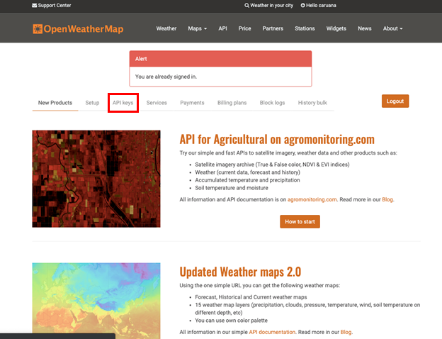
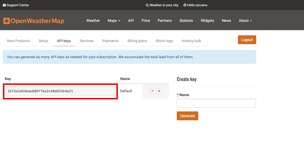
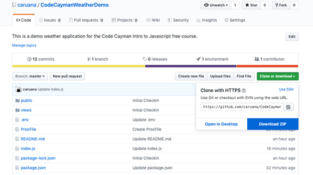

# WEATHER.CODE(CAYMAN)

## PRE-PROJECT SETUP
All source code can be found at [CodeCaymanWeatherDemo](https://github.com/caruana/CodeCaymanWeatherDemo).

- You will need to setup an account at [OpenWeatherMap](https://home.openweathermap.org/) and get an API Key

- Copy and paste that key into the variable WEATHER_APIKEY inside the .env file

## PROJECT SETUP

Download the [CodeCayman Weather Demo](https://github.com/caruana/CodeCaymanWeatherDemo) repository from GitHub.

